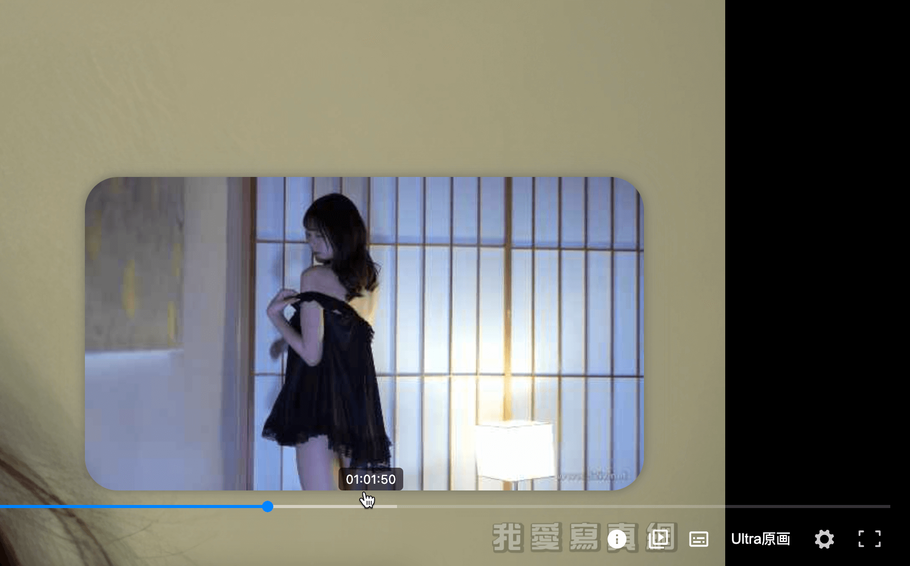
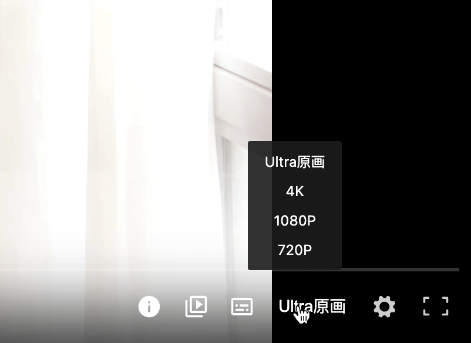
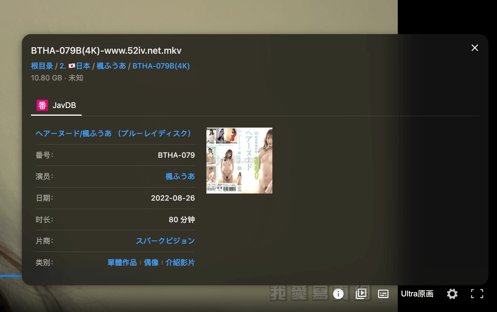
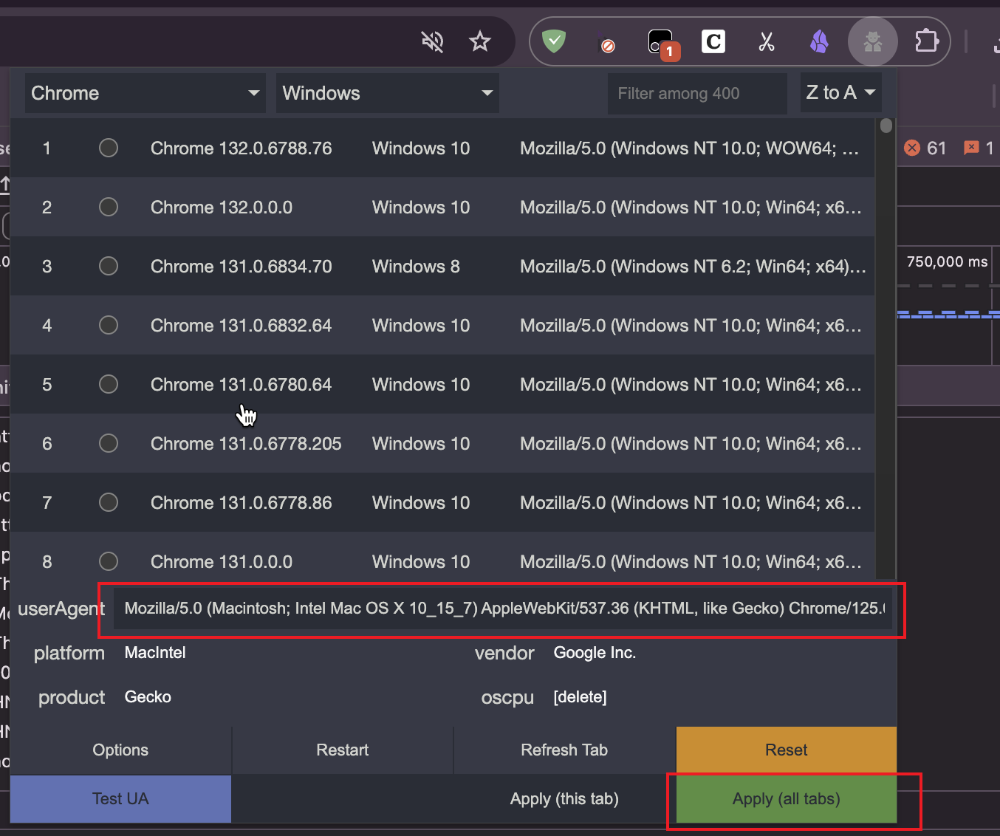

# 115Master

115Master 是一个 115 网盘的 Tempermonkey 脚本，旨在提升 `115网盘` 的浏览体验。

Tips: 小作坊出品下料很猛，请谨慎食用，如果觉得好用，请给个 Star 支持一下，谢谢。






## 功能

- 🎨 `Ultra原画` 增强
- 👁 视频缩略图
- 🚀 超快的加载速度，丝滑的快进、拖拽播放体验 (快好几倍)
- 🤖 根据番号自动匹配在线外挂字幕
- 🔍 播放器集成番号信息展示
- ⌚ 播放器展示播放列表
- 🍯 播放器自动获取视频封面

## 安装

1. 安装 [Tempermonkey](https://www.tampermonkey.net/)，后开启 [浏览器扩展开发者模式](https://www.tampermonkey.net/faq.php#Q209)。

2. 一键安装 [115master.user.js](https://github.com/cbingb666/115master/releases/latest/download/115master.user.js) 安装 【115Master】脚本。

3. 在油猴扩展面板勾选启动 【115Master】脚本，刷新 【115主页】开始使用

4. ⚠️⚠️⚠️ 仍然无法使用，请安装 [User-Agent Switcher and Manager](https://chromewebstore.google.com/detail/user-agent-switcher-and-m/bhchdcejhohfmigjafbampogmaanbfkg) 插件，修改 `User-Agent` 为如下：

    ```txt
    Mozilla/5.0 (Macintosh; Intel Mac OS X 10_15_7) AppleWebKit/537.36 (KHTML, like Gecko) Chrome/125.0.0.0 Safari/537.36 115Browser/27.0.6.3
    ```

    填入 `User-Agent` 后，点击 `Apply（all tabs）` 刷新 115 网盘页面即可生效。

    

5. 👆上面一通操作后，还是无法使用的话请进入 [TG群](https://t.me/+EzfL2xXhlOA4ZjBh) 反馈或提交 [Issues](https://github.com/cbingb666/115master/issues)，请说明你的详情操作！

## 线路图

- [ ] 根据字幕自动生成剧情点
- [ ] 播放页一键收藏
